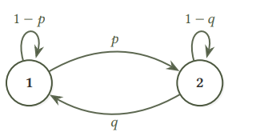
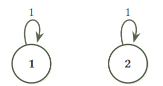
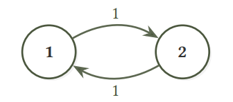
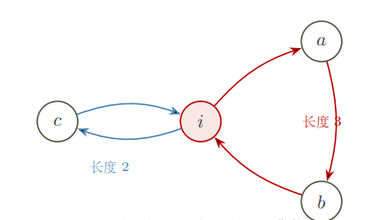

## 离散马尔可夫链

我们用 $X_t$ 来表示 $t$ 时刻的一个状态，我们用扔骰子来举例子，你会发现每次状态的转移只会和上一次状态有关系，也就是 $X_t$ 只和 $X_{t- 1}$ 有关系，和 $X_{t-2},X_{t-3},\dots,X_1,X_0$ 无关，这个性质叫做马尔可夫性，满足了这个性质的随机变量序列就叫做马尔可夫链

!!! info "Definition"

    **离散马尔可夫链** 
    
    假设有一列离散随机变量 $X_0, X_1, \ldots, X_t, \ldots$，其中每一个 $X_t$ 的取值都来自于可数集合 $S$。如果 $\forall t \ge 1$，随机变量 $X_t$ 的分布只依赖于 $X_{t-1}$，即 $\forall a_0, a_1, \ldots, a_t \in S$，
    
    $$
    \mathbb{P}[X_t = a_t \mid X_{t-1} = a_{t-1}, \ldots, X_1 = a_1, X_0 = a_0]
    =
    \mathbb{P}[X_t = a_t \mid X_{t-1} = a_{t-1}].
    $$
    
    那么，我们称 $\{X_t\}$ 为离散马尔可夫链。

对于每个 $t \ge 1$ 我们可以用一个 $N \times N$ 的矩阵 $p^{(t)} = (p_{ij} ^ {(t)})$来表示从时间 $t-1$ 到时间 $t$ 的转移概率，其中

$$
p_{ij} ^ {(t)} = \mathbb{P}[X_t = j \mid X_{t-1} =i]
$$

很明显 $p^{(t)}$ 和 $t$ 无关，因为在转移的时候我们每次的概率是一样的，我们把它简写为 $P$ ，满足这个性质的马尔可夫链我们叫时间齐次马尔可夫链，矩阵 $P$ 被称为马尔可夫链的转移矩阵

!!! example "Example：有限状态随机游走"

    图 2.2 为转移矩阵
    
    $$
    P = (p_{ij}) =
    \begin{bmatrix}
    1/2 & 3/8 & 1/8 \\
    1/3 & 0 & 2/3 \\
    1/4 & 3/4 & 0
    \end{bmatrix}
    $$
    
    对应的转移图

{ .center width="30%" }

<em>图 2.2</em>

### 使用线性代数

一个贯穿本书始终的记号是我们会使用 $\mu_t$ 来表示马尔可夫链里 $X_t$ 的分布。也就是说，

$$
\forall i \in [N],\quad \mu_t(i)=\mathbb{P}[X_t=i].
$$

因此，$\mu$ 是一个定义在 $[N]$ 上的，取值为 $[0,1]$ 的函数，并且满足 $\sum_{i\in[N]}\mu(i)=1$。我们有的时候也会把它等价的看成是 $[0,1]^N$ 里的一个列向量，即 $\mu=(\mu(1),\mu(2),\ldots,\mu(N))^{\mathrm T}$。

根据全概率公式，有 $\mu_{t+1}(j)=\sum_i \mu_t(i)\cdot p_{ij}$ 成立。把它写成矩阵的形式，便是

$$
\mu_t^{\mathrm T}P=\mu_{t+1}^{\mathrm T}.
$$

这便给了我们一个从任何 $\mu_s\ (s\ge 0)$ 出发计算 $\mu_{s+t}$ 的公式

$$
\mu_{s+t}^{\mathrm T}=\mu_s^{\mathrm T}P^t.
$$

从式也可以看出来，矩阵 $P^t$ 直观上可以解释成马尔可夫链走 $t$ 步的转移矩阵。使用矩阵乘法的结合律，我们显然有等式

$$
\forall s,t\ge 0:\quad P^{s+t}=P^sP^t.
$$

这个等式在随机过程的文献里被称为查普曼-科尔莫戈罗夫方程。由此可见，每个时间点的分布完全由转移矩阵 $P$ 和初始分布 $\mu_0$ 决定。

### 马尔可夫链的平稳分布

我们拿洗牌举例子，在多次洗牌之后，牌堆的顺序会不会接近于均匀随机，这就引出了平稳分布这个概念，对于洗牌来说，确实是这样，因为均匀分布是洗牌这个马尔可夫链所对应的唯一的平稳分布，并且从任何一个分布出发，执行足够多的次数后，均会收敛到它

!!! info "Definition"

    **定义 2.6 平稳分布**
    
    考虑转移矩阵为 $P$ 的马尔可夫链。如果一个分布 $\pi$ 在马尔可夫链中随时间推移保持不变，即满足
    
    $$
    \pi^{\mathrm T}P=\pi^{\mathrm T},
    $$
    
    那么称 $\pi$ 为 $P$ 的平稳分布。

举个例子，回忆转移矩阵

$$
P=
\begin{bmatrix}
1/2 & 3/8 & 1/8 \\
1/3 & 0 & 2/3 \\
1/4 & 3/4 & 0
\end{bmatrix}
$$

我们要求解 $\pi^{\mathrm T}P=\pi^{\mathrm T}$，结合 $\sum_i \pi(i)=1$。取后面两个方程：

$$
\frac{3}{8}\pi(1)+\frac{3}{4}\pi(3)=\pi(2),
$$

$$
\frac{1}{8}\pi(1)+\frac{2}{3}\pi(2)=\pi(3)
$$

解方程可得 $\pi(1):\pi(2):\pi(3)=16:15:12$，即

$$
\pi=
\left(
\frac{16}{43},
\frac{15}{43},
\frac{12}{43}
\right)^{\mathrm T}
$$

但是并非每个马尔可夫链都有平稳分布，我们再看个例子。如果 $\pi$ 是平稳分布，则对每个 $i\in\mathbb{Z}$

$$
\pi(i)=\frac{1}{2}\pi(i-1)+\frac{1}{2}\pi(i+1)
$$

即 $\pi(i+1)-\pi(i)=\pi(i)-\pi(i-1)$。这意味着差分 $\pi(i+1)-\pi(i)$ 是常数，也就是 $\pi$ 是关于 $i$ 的一次函数：$\pi(i)=a+bi$。但 $\pi$ 必须非负且可求和（$\sum_{i\in\mathbb{Z}}\pi(i)=1$），所以只能 $b=0$，即 $\pi$ 是常值函数。然而常值函数在 $\mathbb{Z}$ 的求和是无穷大。因此，$\mathbb{Z}$ 上的简单随机游走不存在平稳分布。

## 马尔可夫链基本定理

### 平稳分布的存在性

我们将证明，对于每个有限的马尔可夫链 $P$，总存在某个 $\pi$ 使得 $\pi^{\mathrm T}P=\pi^{\mathrm T}$。注意，这等价于“$1$ 是 $P^{\mathrm T}$ 的一个特征值，并且它有一个非负特征向量（$P^{\mathrm T}\pi=\pi$）”。我们首先注意到，矩阵 $P$ 满足 $P\mathbf{1}=\mathbf{1}$，即 $1$ 是 $P$ 的特征值，而 $P$ 与 $P^{\mathrm T}$ 有同样的特征多项式，因此，$1$ 也是 $P^{\mathrm T}$ 的特征值。于是，我们可以找到一个向量 $\mathbf{v}$，满足 $P^{\mathrm T}\mathbf{v}=\mathbf{v}$。但是，这个 $\mathbf{v}$ 并不一定是非负的，我们现在说明，如果我们定义 $\pi(i)=|\mathbf{v}(i)|$，那么 $\pi$ 是 $P^{\mathrm T}$ 对应于 $1$ 的一个特征向量。对于任何 $i\in[N]$，我们可以验证，

$$
\pi(i)=|\mathbf{v}(i)|
=
\left|
\sum_{j\in[N]}\mathbf{v}(j)\cdot P(j\to i)
\right|
\le
\sum_{j\in[N]}|\mathbf{v}(j)|\cdot P(j\to i)
=
\sum_{j\in[N]}\pi(j)\cdot P(j\to i).
$$

我们只需要说明，对于每一个 $i$，上面式子中的 $\le$ 都必须取到等号即可。我们用反证法先假设某一个 $i$ 没有取到等号，那么对所有 $\mathbf{v}(i)$ 求和，有

$$
\begin{aligned}
\left|\sum_{i\in[N]}|\mathbf v(i)|\right|
&<
\left|\sum_{i\in[N]}\sum_{j\in[N]}|\mathbf v(j)|\cdot P(j\to i)\right| \\
&=
\left|\sum_{j\in[N]}|\mathbf v(j)|\cdot \sum_{i\in[N]}P(j\to i)\right| \\
&=
\left|\sum_{j\in[N]}|\mathbf v(j)|\right|.
\end{aligned}
$$

但这显然是矛盾的，因为上述式子的头和尾是同一个东西。因此，$\pi$ 是 $P^{\mathrm T}$ 的一个非负的特征向量。于是，$\dfrac{\pi}{|\pi|_1}$ 是马尔可夫链 $P$ 的一个平稳分布。

### 唯一性和收敛性

接下来来讨论平稳分布的唯一性，以及在已经知道平稳分布唯一的情况下，是否能从任意分布出发收敛到它。我们先来定义下收敛，对于定义在 $[N]$ 上的分布 $\mu_t$，我们说它收敛到分布 $\pi$，如果对于每一个 $i\in[N]$，都有

$$
\lim_{t\to\infty}\mu_t(i)=\pi(i).
$$
我们从只包含两个状态的马尔可夫链来出发研究这个问题，马尔可夫链的转移矩阵为 $P=
\begin{bmatrix}
1-p & p \\
q & 1-q
\end{bmatrix}$，马尔可夫链如下图

{ .center width="30%" }

并且，容易验证$\pi=
\left(
\frac{q}{p+q},
\frac{p}{p+q}
\right)^{\mathrm T}$ 是 $P$ 的一个平稳分布。我们将验证是否从任意初始分布 $\mu_0$ 出发，分布 $\mu_t$ 总是收敛到 $\pi$。在我们的例子里，由于分布只有两个维度，并且两维之和等于 $1$，因此我们只需检查第一维是否收敛，即

$$
\lim_{t\to\infty}
\left|
\mu_0^{\mathrm T}P^t(1)-\pi(1)
\right|
\to 0
$$

是否成立。现在我们定义 $\Delta_t:=|\mu_t(1)-\pi(1)|$，并研究其如何随着 $t$ 变化。我们知道 $\mu_t^{\mathrm T}=\mu_{t-1}^{\mathrm T}P$，因此我们有

$$
\Delta_t
=
\left|
\mu_{t-1}^{\mathrm T}\cdot P(1)-\pi(1)
\right|
=
\left|
(1-p)\cdot \mu_{t-1}(1)
+
q\cdot (1-\mu_{t-1}(1))
-
\frac{q}{p+q}
\right|
$$

整理可得$\Delta_t=|1-p-q|\cdot \Delta_{t-1}$ 因此可以看出，除非 $p=q=0$ 或者 $p=q=1$，$\Delta_t\to 0$ 总成立。

这两种情况对应了两种不收敛的原因，我们讨论下

**$p=q=0$的情况**

{ .center width="30%" }

这个马尔可夫链的转移图是不连通的，可以划分成两个不相交的子图，每个子图依然是一个马尔可夫链，，并且各自都有自己的平稳分布，思考一下可以发现这些子分布的任何混合都是整个马尔可夫链的平稳分布。因此，在这种情况下平稳分布不是唯一的，我们想把这种平稳分布不唯一的情况进行推广，，所以给出如下定义

!!! info "Definition"

    **定义 2.8 可约与不可约。**
    
    如果一个有限马尔可夫链的转移图是强连通的，我们称该马尔可夫链是不可约的。如果转移图不是强连通的，我们称其为可约的。

不可约性其实是具有唯一平稳分布的充分条件

**$p=q=1$的情况**

{ .center width="30%" }

这个马尔可夫链的状态转移图是二分图，显然$(\frac{1}{2},\frac{1}{2})$ 是其唯一的平稳分布，然而，对于初始分布 $\mu_0=(1,0)^{\mathrm T}$，可以看到 $\mu_t$ 在 $(1,0)^{\mathrm T}$ 和 $(0,1)^{\mathrm T}$ 之间振荡。因此，它并不总是收敛到平稳分布。我们来推广这种“振荡”的概念。

对于一个马尔可夫链的状态 $i$，我们用 $C_i$ 来表示包含 $i$ 的所有有向环的集合。

!!! info "Definition"

    **定义 2.9 周期性与无周期性。**
    
    如果对于马尔可夫链的一个状态 $i$，满足
    
    $$
    \gcd(\{|c|:c\in C_i\})=1,
    $$
    
    那么我们就称 $i$ 是无周期性（aperiodic）的，否则，就称它为周期性（periodic）的。如果一个马尔可夫链中的每一个状态都是无周期性的，则称该马尔可夫链是无周期性的。

我们应该这样来理解周期性的定义，假设一个包含点 $i$ 的所有有向环长度的最大公约数比如是3，那么就说明我们从 $i$ 出发，一定只有在3的倍数步后才能回到 $i$，这个性质推广了我们在两个点的例子中提到的循环振荡的现象

{ .center width="30%" }

上图是状态 $i$ 包含在一个长度为 $2$ 的环和一个长度为 $3$ 的环中。由于 $\gcd(2,3)=1$，$i$ 是无周期的。

实际上，对于有限状态马尔可夫链来说，不可约性和无周期性就保证了平稳分布是唯一存在，并且从任意分布出发都能收敛到它。这便是我们接下来要介绍的马尔可夫链基本定理，它是我们第一个关于马尔可夫链的重要定理。

!!! info "Definition"

    **定理 2.10 马尔可夫链基本定理。**
    
    如果有限马尔可夫链 $P\in\mathbb{R}^{N\times N}$ 是不可约且无周期性的，那么它有唯一的平稳分布 $\pi\in\mathbb{R}^N$，并且对于任意分布 $\mu\in\mathbb{R}^N$，
    
    $$
    \lim_{t\to\infty}\mu^{\mathrm T}P^t=\pi^{\mathrm T}.
    $$

## 时间反演，可逆链与Metropolis-Hastings 算法

### 时间反演链

假设一条马尔可夫链一直在平稳分布 $\pi$ 下运行，这时一个自然的问题是：如果我们把这条链的演化录像倒放，倒放后的过程还是马尔可夫链吗？这是肯定的，我们可以直接写出它的转移概率

!!! info "Definition"

    **定义 2.11 时间反演链。**
    
    设 $P$ 是状态空间 $[N]$ 上的马尔可夫链的转移矩阵，$\pi$ 是它的一个平稳分布，并且满足 $\forall i\in[N],\ \pi(i)>0$。定义矩阵 $\hat P$ 为
    
    $$
    \forall i,j\in[N],\quad
    \hat P(i,j):=\frac{\pi(j)P(j\to i)}{\pi(i)}.
    $$
    
    我们称 $\hat P$ 为 $P$ 关于平稳分布 $\pi$ 的时间反演链（time reversal chain）。

