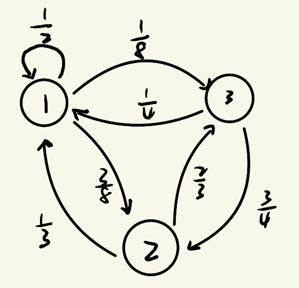

### 离散马尔可夫链

我们用 $X_t$ 来表示 $t$ 时刻的一个状态，我们用扔骰子来举例子，你会发现每次状态的转移只会和上一次状态有关系，也就是 $X_t$ 只和 $X_{t- 1}$ 有关系，和 $X_{t-2},X_{t-3},\dots,X_1,X_0$ 无关，这个性质叫做马尔可夫性，满足了这个性质的随机变量序列就叫做马尔可夫链

!!! info "Definition"

    **离散马尔可夫链** 
    
    假设有一列离散随机变量 $X_0, X_1, \ldots, X_t, \ldots$，其中每一个 $X_t$ 的取值都来自于可数集合 $S$。如果 $\forall t \ge 1$，随机变量 $X_t$ 的分布只依赖于 $X_{t-1}$，即 $\forall a_0, a_1, \ldots, a_t \in S$，
    
    $$
    \mathbb{P}[X_t = a_t \mid X_{t-1} = a_{t-1}, \ldots, X_1 = a_1, X_0 = a_0]
    =
    \mathbb{P}[X_t = a_t \mid X_{t-1} = a_{t-1}].
    $$
    
    那么，我们称 $\{X_t\}$ 为离散马尔可夫链。

对于每个 $t \ge 1$ 我们可以用一个 $N \times N$ 的矩阵 $p^{(t)} = (p_{ij} ^ {(t)})$来表示从时间 $t-1$ 到时间 $t$ 的转移概率，其中

$$
p_{ij} ^ {(t)} = \mathbb{P}[X_t = j \mid X_{t-1} =i]
$$

很明显 $p^{(t)}$ 和 $t$ 无关，因为在转移的时候我们每次的概率是一样的，我们把它简写为 $P$ ，满足这个性质的马尔可夫链我们叫时间齐次马尔可夫链，矩阵 $P$ 被称为马尔可夫链的转移矩阵

!!! example "Example：有限状态随机游走"

    图 2.2 为转移矩阵
    
    $$
    P = (p_{ij}) =
    \begin{bmatrix}
    1/2 & 3/8 & 1/8 \\
    1/3 & 0 & 2/3 \\
    1/4 & 3/4 & 0
    \end{bmatrix}
    $$
    
    对应的转移图

{ .center width="30%" }

<em>图 2.2</em>

